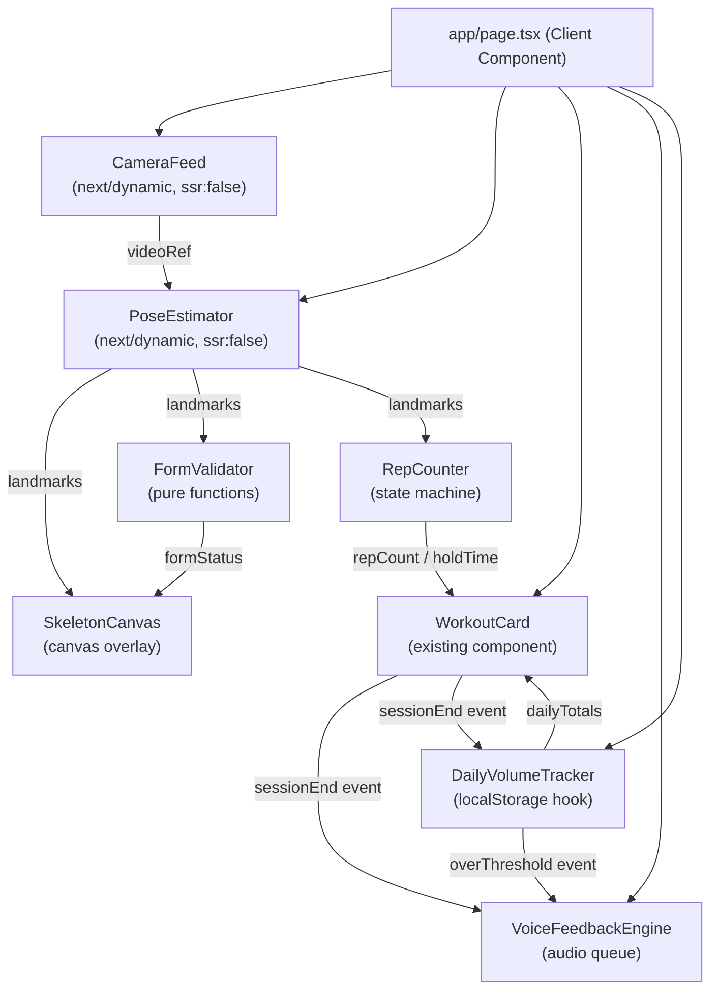

# Design Document: Push-Up Fitness Tracker

## Overview

This feature transforms the existing Next.js fitness app into a real-time push-up tracking experience. A full-screen camera feed serves as the page background, with the existing `WorkoutCard` overlaid on top. MediaPipe Pose Landmarker runs entirely in the browser to detect body landmarks, validate push-up form per variation, and count reps automatically. After each set, ElevenLabs AI voice feedback is played via the existing `/api/tts` route. A daily volume tracker persists progress to `localStorage` and triggers a voice warning when the user exceeds a configurable rep threshold.

All browser-only modules (MediaPipe, `getUserMedia`, `Audio`) are loaded via `next/dynamic` with `ssr: false` inside Client Components, which is the correct pattern for Next.js 16 (the `ssr: false` option is only valid inside Client Components).

### Key Design Decisions

- **MediaPipe `@mediapipe/tasks-vision` (lite model)**: Chosen over the legacy `@mediapipe/pose` package because `tasks-vision` is the current supported API, ships a self-contained WASM bundle, and the `lite` variant keeps inference latency low on consumer hardware.
- **Canvas overlay for skeleton**: A `<canvas>` element absolutely positioned over the `<video>` element, sized to match via a `ResizeObserver`, avoids any layout reflow and keeps rendering in a single compositing layer.
- **Pure angle-based form validation**: Joint angles computed from 3-D landmark coordinates are a deterministic, testable function — no ML model needed for the form layer.
- **Message queue for voice feedback**: A simple FIFO queue with an `isPlaying` flag ensures audio messages never overlap and are never dropped.
- **`localStorage` for daily volume**: Keeps the feature entirely client-side with no backend dependency. Key format `pushup-daily-volume-{YYYY-MM-DD}` provides automatic day-boundary isolation.

---

## Architecture

The feature is composed of five client-side modules wired together through React state and callbacks. The `WorkoutCard` remains the authoritative source of workout state (which exercise is active, current set, session status). The new modules read from and write to it via props/callbacks.



### Data Flow Summary

1. `CameraFeed` acquires the `getUserMedia` stream and exposes a `videoRef`.
2. `PoseEstimator` runs `requestAnimationFrame` loop, calls MediaPipe on each frame, emits `landmarks | null`.
3. `FormValidator` and `RepCounter` receive landmarks on every frame; they are pure/near-pure functions with no side effects.
4. `SkeletonCanvas` draws the skeleton overlay, coloured by form status.
5. When the user presses **Done** on `WorkoutCard`, it fires `onSessionEnd(reps, calories, exerciseId)`.
6. `DailyVolumeTracker` persists the update; if the threshold is exceeded it calls `VoiceFeedbackEngine.enqueue(warningMessage)`.
7. `VoiceFeedbackEngine` drains its queue by calling `/api/tts` and playing the returned audio blob.

---

## Components and Interfaces

### `CameraFeed` (`components/camera-feed.tsx`)

Loaded with `next/dynamic` + `ssr: false` from a Client Component.

```typescript
interface CameraFeedProps {
  onStreamReady: (videoEl: HTMLVideoElement) => void;
  onError: (reason: 'denied' | 'unsupported') => void;
  mirrored?: boolean; // default true — CSS scaleX(-1)
}
```

Responsibilities:
- Calls `navigator.mediaDevices.getUserMedia({ video: { width: 1280, height: 720 } })`.
- Renders `<video>` as `position: fixed; inset: 0; width: 100vw; height: 100vh; object-fit: cover; z-index: 0`.
- Applies `transform: scaleX(-1)` when `mirrored` is true.
- Calls `track.stop()` on all `MediaStreamTrack` objects in a `useEffect` cleanup.
- Exposes the `<video>` element via `onStreamReady` once `loadedmetadata` fires.

### `PoseEstimator` (`components/pose-estimator.tsx`)

Loaded with `next/dynamic` + `ssr: false`.

```typescript
interface PoseEstimatorProps {
  videoEl: HTMLVideoElement | null;
  isActive: boolean; // pauses rAF loop when false
  onLandmarks: (landmarks: NormalizedLandmark[] | null) => void;
}

// Re-exported from @mediapipe/tasks-vision
type NormalizedLandmark = { x: number; y: number; z: number; visibility: number };
```

Responsibilities:
- Lazily initialises `PoseLandmarker` from `@mediapipe/tasks-vision` with `lite` model on first mount.
- Runs `requestAnimationFrame` loop calling `poseLandmarker.detectForVideo(videoEl, timestamp)`.
- Emits `null` when no pose is detected or `isActive` is false.
- Cancels the rAF handle and calls `poseLandmarker.close()` on unmount.

### `SkeletonCanvas` (`components/skeleton-canvas.tsx`)

```typescript
interface SkeletonCanvasProps {
  landmarks: NormalizedLandmark[] | null;
  formStatus: 'good' | 'bad' | 'unknown';
  activeVariation: ExerciseId;
  videoEl: HTMLVideoElement | null;
}
```

Responsibilities:
- Renders a `<canvas>` with `position: fixed; inset: 0; z-index: 1; pointer-events: none`.
- Uses a `ResizeObserver` on `videoEl` to keep canvas dimensions in sync.
- Draws only the joints relevant to `activeVariation` (see joint map in Data Models).
- Colours connections green (`#22c55e`) for `'good'`, red (`#ef4444`) for `'bad'`, white semi-transparent for `'unknown'`.

### `FormValidator` (`lib/form-validator.ts`)

Pure module — no React, no side effects.

```typescript
type FormStatus = 'good' | 'bad' | 'unknown';

interface FormValidationResult {
  status: FormStatus;
  cue: string | null; // e.g. "Keep hips straight"
}

function validateForm(
  landmarks: NormalizedLandmark[] | null,
  variation: ExerciseId
): FormValidationResult
```

Internally delegates to per-variation validators that each call `computeAngle(a, b, c)`.

```typescript
function computeAngle(
  a: NormalizedLandmark,
  b: NormalizedLandmark, // vertex
  c: NormalizedLandmark
): number // degrees 0–180
```

Returns `'unknown'` when any key landmark has `visibility < 0.5`.

### `RepCounter` (`lib/rep-counter.ts`)

Near-pure state machine — takes current state + landmarks, returns next state.

```typescript
type RepPhase = 'up' | 'down' | 'idle';

interface RepCounterState {
  phase: RepPhase;
  count: number;
  holdSeconds: number; // plank only
}

function updateRepCounter(
  state: RepCounterState,
  landmarks: NormalizedLandmark[] | null,
  variation: ExerciseId,
  deltaSeconds: number
): RepCounterState
```

Phase transitions:
- `idle → down`: elbow angle < 120° and body in plank position.
- `down → up`: elbow angle > 150°.
- `up → down`: elbow angle < 120° again (next rep).
- On `down → up` transition: `count += 1`.
- For plank: no phase transitions; `holdSeconds += deltaSeconds` while form is `'good'`.

### `VoiceFeedbackEngine` (`lib/voice-feedback-engine.ts`)

```typescript
interface VoiceFeedbackEngine {
  enqueue(message: string): void;
  dispose(): void;
}

function createVoiceFeedbackEngine(): VoiceFeedbackEngine
```

Internally maintains a `string[]` queue and an `isPlaying: boolean` flag. When `enqueue` is called:
1. Push message to queue.
2. If not playing, call `_playNext()`.

`_playNext()`:
1. Shift first message from queue.
2. `POST /api/tts` with `{ text: message }`.
3. Convert response to `Blob`, create `URL.createObjectURL`, play via `new Audio(url)`.
4. On `audio.onended`: revoke object URL, call `_playNext()` if queue is non-empty.
5. On fetch error: log to console, call `_playNext()` to drain remaining queue.

### `DailyVolumeTracker` (`lib/use-daily-volume.ts`)

Custom React hook.

```typescript
interface DailyVolume {
  reps: number;
  calories: number;
  date: string; // YYYY-MM-DD
}

interface UseDailyVolumeReturn {
  dailyVolume: DailyVolume;
  addSession(reps: number, calories: number): void;
  threshold: number;
  setThreshold(n: number): void;
  isOverThreshold: boolean;
}

function useDailyVolume(defaultThreshold?: number): UseDailyVolumeReturn
```

- On mount: reads `localStorage.getItem('pushup-daily-volume-{today}')`. If the stored date differs from today, resets to zero.
- `addSession`: updates state and writes back to `localStorage`.
- `isOverThreshold`: derived value — `dailyVolume.reps > threshold`.

### Updated `app/page.tsx`

Wires all components together. Manages shared state: `videoEl`, `landmarks`, `formStatus`, `repCounterState`, `isSessionActive`.

---

## Data Models

### Landmark Index Map (MediaPipe Pose — 33 landmarks)

Key indices used by this feature:

| Index | Joint |
|-------|-------|
| 11 | Left shoulder |
| 12 | Right shoulder |
| 13 | Left elbow |
| 14 | Right elbow |
| 15 | Left wrist |
| 16 | Right wrist |
| 23 | Left hip |
| 24 | Right hip |
| 27 | Left ankle |
| 28 | Right ankle |

### Variation → Joint Rules

| Variation | Key Joints (indices) | Good Form Condition |
|---|---|---|
| push-ups | 11/12, 13/14, 23/24, 27/28 | Elbow 80–110° at bottom; hip-shoulder-ankle deviation < 15° |
| diamond-push-ups | 13/14, 15/16, 11/12 | Elbow 70–100° at bottom; wrist distance < 0.1 (normalised) |
| wide-push-ups | 13/14, 11/12 | Elbow 80–120° at bottom; wrist width > 1.5× shoulder width |
| archer-push-ups | 13 or 14 (lead), 11/12 | Lead elbow 70–100°; trailing elbow > 150° |
| decline-push-ups | 23/24, 11/12, 27/28 | Hip deviation < 10°; elbow 80–110° |
| incline-push-ups | 23/24, 11/12, 15/16 | Hip deviation < 10°; elbow 80–110° |
| plank | 23/24, 11/12, 27/28 | Hip deviation < 10°; held continuously |

### `DailyVolume` (localStorage)

```json
{
  "date": "2025-01-15",
  "reps": 120,
  "calories": 48.0
}
```

Key: `pushup-daily-volume-2025-01-15`

### Calorie Estimation

```
calories = MET × weight_kg × duration_hours
```

- MET: `8.0` for all push-up variations, `3.0` for plank.
- `weight_kg`: user-configurable, defaults to `70`.
- `duration_hours`: set duration in hours (tracked from Start → Done).

### `SessionResult` (passed from WorkoutCard to callbacks)

```typescript
interface SessionResult {
  exerciseId: ExerciseId;
  reps: number;           // from RepCounter
  durationSeconds: number;
  calories: number;       // computed by VoiceFeedbackEngine
  isWorkoutComplete: boolean;
}
```

---

## Correctness Properties

*A property is a characteristic or behavior that should hold true across all valid executions of a system — essentially, a formal statement about what the system should do. Properties serve as the bridge between human-readable specifications and machine-verifiable correctness guarantees.*

### Property 1: Angle computation is symmetric and bounded

*For any* three landmarks A, B (vertex), C, the computed joint angle shall be in the range [0°, 180°], and `computeAngle(A, B, C) === computeAngle(C, B, A)`.

**Validates: Requirements 3.2, 4.1, 4.2**

---

### Property 2: Form validation returns `unknown` for low-visibility landmarks

*For any* landmark set where at least one key joint for the active variation has `visibility < 0.5`, `validateForm` shall return `status: 'unknown'` regardless of the angle values.

**Validates: Requirements 3.6**

---

### Property 3: Rep counter is monotonically non-decreasing

*For any* sequence of landmark frames fed to `updateRepCounter`, the `count` field in the returned state shall never decrease.

**Validates: Requirements 4.3, 4.6**

---

### Property 4: Rep counter resets cleanly

*For any* `RepCounterState` with `count > 0`, resetting (passing a fresh initial state) shall produce `count === 0` and `phase === 'idle'`.

**Validates: Requirements 4.6**

---

### Property 5: Calorie formula is consistent

*For any* valid `(MET, weight_kg, duration_hours)` triple, the calorie estimate shall equal `MET × weight_kg × duration_hours`, and doubling `duration_hours` shall exactly double the calorie result.

**Validates: Requirements 5.2**

---

### Property 6: Daily volume accumulation is additive

*For any* sequence of sessions with reps `[r₁, r₂, …, rₙ]`, the total daily reps after all sessions shall equal `r₁ + r₂ + … + rₙ`.

**Validates: Requirements 6.1, 6.2**

---

### Property 7: Daily volume localStorage round-trip

*For any* `DailyVolume` object, serialising it to `localStorage` and reading it back shall produce an object with identical `date`, `reps`, and `calories` values.

**Validates: Requirements 6.1**

---

### Property 8: Over-threshold detection is consistent with accumulation

*For any* daily volume state and threshold value, `isOverThreshold` shall be `true` if and only if `dailyVolume.reps > threshold`.

**Validates: Requirements 6.3, 6.6**

---

### Property 9: Voice feedback queue preserves message order

*For any* sequence of messages enqueued before playback begins, the messages shall be played in FIFO order.

**Validates: Requirements 5.6**

---

### Property 10: Plank hold time is non-negative and monotonically increasing

*For any* sequence of `deltaSeconds > 0` updates while form is `'good'`, the `holdSeconds` field shall increase by exactly the sum of all `deltaSeconds` values.

**Validates: Requirements 4.7**

---

## Error Handling

| Scenario | Handling |
|---|---|
| `getUserMedia` denied | `CameraFeed` calls `onError('denied')`; page renders full-screen placeholder; `WorkoutCard` remains functional for manual entry |
| `getUserMedia` not supported | `CameraFeed` calls `onError('unsupported')`; message "Camera not supported on this device" |
| MediaPipe WASM fails to load | `PoseEstimator` catches the error, emits `null` landmarks continuously; UI shows "Pose detection unavailable" |
| No pose detected in frame | `PoseEstimator` emits `null`; `FormValidator` returns `'unknown'`; `RepCounter` holds current state |
| `/api/tts` returns error | `VoiceFeedbackEngine` logs to console, skips that message, continues draining queue |
| `localStorage` unavailable (private browsing) | `useDailyVolume` catches `SecurityError`, operates in-memory only for the session |
| Page unload while camera active | `useEffect` cleanup in `CameraFeed` stops all `MediaStreamTrack` objects |

---

## Testing Strategy

### Unit Tests (Vitest)

Focus on the pure/near-pure logic modules:

- **`computeAngle`**: specific examples with known angles (0°, 90°, 180°, and intermediate values).
- **`validateForm`**: one example per variation for good form, bad form, and low-visibility landmarks.
- **`updateRepCounter`**: example-based tests for each phase transition (idle→down, down→up, up→down), plank hold accumulation, and reset.
- **`useDailyVolume`**: example tests for `addSession`, day-boundary reset, and threshold detection using `localStorage` mock.
- **`VoiceFeedbackEngine`**: mock `fetch` and `Audio`; verify queue draining order and error resilience.

### Property-Based Tests (fast-check)

The feature has several pure functions with well-defined universal properties. Use [fast-check](https://github.com/dubzzz/fast-check) (the standard PBT library for TypeScript/JavaScript).

Each property test runs a minimum of **100 iterations**.

Tag format: `// Feature: pushup-fitness-tracker, Property N: <property text>`

**Property 1 — Angle symmetry and bounds** (`computeAngle`):
Generate three random `NormalizedLandmark` objects; assert result ∈ [0, 180] and `computeAngle(A,B,C) === computeAngle(C,B,A)`.

**Property 2 — Unknown form on low visibility** (`validateForm`):
Generate landmark sets where at least one key joint has `visibility < 0.5`; assert `status === 'unknown'` for all variations.

**Property 3 — Rep count monotonicity** (`updateRepCounter`):
Generate random sequences of landmark frames; assert `nextState.count >= prevState.count` at every step.

**Property 4 — Rep counter reset** (`updateRepCounter`):
Generate any `RepCounterState`; assert that applying a fresh initial state produces `count === 0, phase === 'idle'`.

**Property 5 — Calorie formula linearity** (calorie utility):
Generate random `(MET, weight_kg, duration_hours)` triples; assert `calories === MET * weight_kg * duration_hours` and that doubling `duration_hours` doubles the result.

**Property 6 — Daily volume additivity** (`useDailyVolume` / `addSession`):
Generate random arrays of `(reps, calories)` session pairs; assert total reps equals sum of individual reps.

**Property 7 — localStorage round-trip** (`DailyVolume` serialisation):
Generate random `DailyVolume` objects; assert `JSON.parse(JSON.stringify(v))` produces equal `date`, `reps`, `calories`.

**Property 8 — Over-threshold consistency** (`isOverThreshold`):
Generate random `(reps, threshold)` pairs; assert `isOverThreshold === (reps > threshold)`.

**Property 9 — Queue FIFO order** (`VoiceFeedbackEngine`):
Generate random arrays of message strings; enqueue all before playback starts; assert playback order matches input order.

**Property 10 — Plank hold time accumulation** (`updateRepCounter` plank path):
Generate random arrays of positive `deltaSeconds` values; assert final `holdSeconds === sum(deltas)`.

### Integration Tests

- **Camera + Pose pipeline**: manual/E2E test with a real device; verify skeleton appears within 2 seconds of page load.
- **TTS route**: verify `/api/tts` returns `audio/mpeg` with a valid non-empty body for a sample text string.
- **Daily volume persistence**: verify `localStorage` key is written after a session ends and survives a page reload.

### Accessibility

- All overlaid text indicators (form cues, rep count) use sufficient contrast ratios (≥ 4.5:1 against the camera background via a semi-transparent backdrop).
- The camera placeholder and error messages are announced via `role="alert"`.
- `WorkoutCard` retains full keyboard operability when camera is unavailable.
